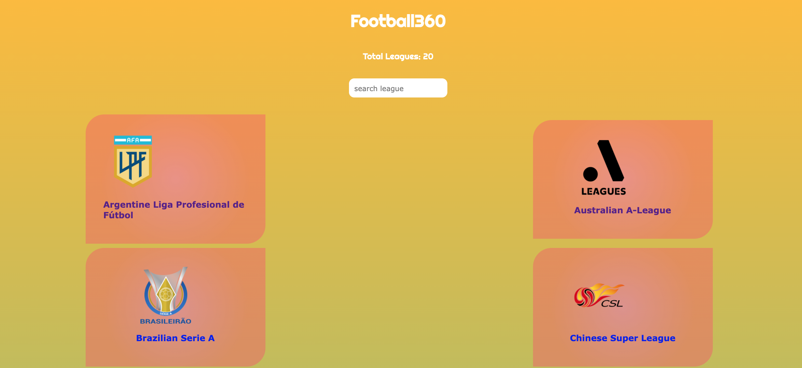
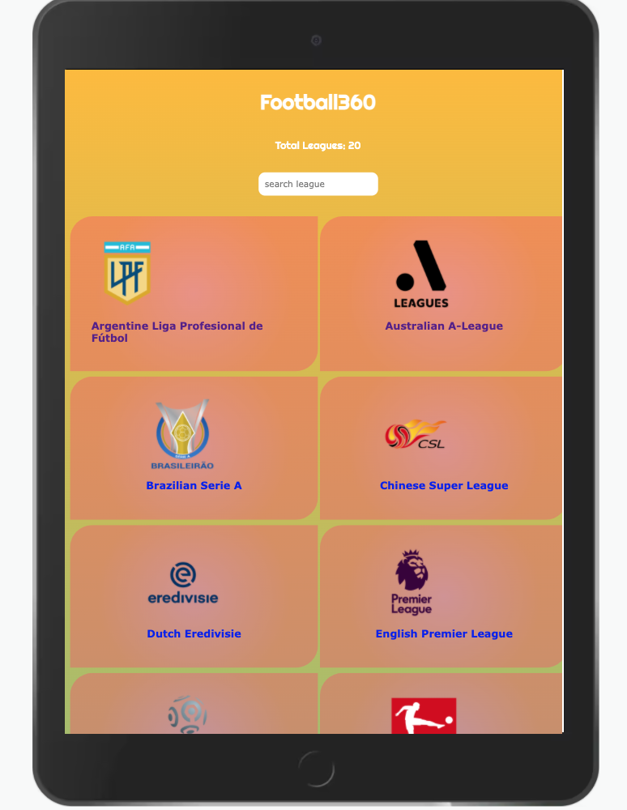
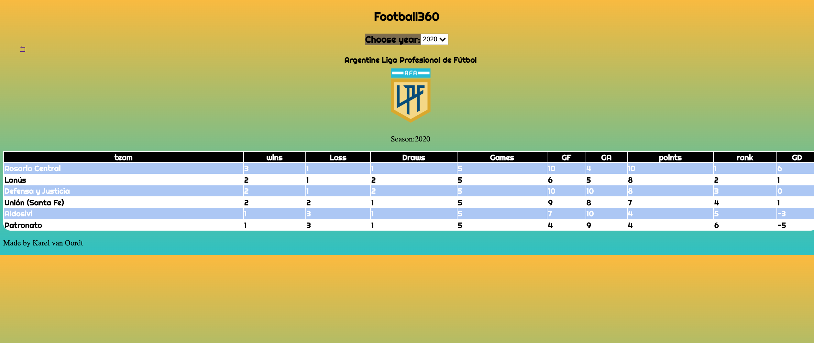

# Football-Leaderboards

> This is a single page web application that displays many of the most important football leagues leaderboards.






## Built With

- React.js
- Redux for State management
- API
- CSS3

## Live Demo

[Live Demo Link](https://karelvanoordt-football360.herokuapp.com/)
[Loom Video Explanation](https://www.loom.com/share/b5151a90027c4c5a89bc3da0fa3e448d)


## Getting Started

**To clone this project**
**Run command: ```$git clone ``` [repo](https://github.com/karelvanoordt/football-leaderboards.git)**
**or press the green Code button in the upper right corner and choose to download from the Download ZIP link.**

## Prerequisites

- Code editor (VS Code, Sublime, Atom)

### Setup

- to create a React application is using Create React App (CRA) and following the instructions in this [guide](https://reactjs.org/docs/create-a-new-react-app.html#create-react-app)
```
npx create-react-app bookstore-react
cd bookstore-react
npm start
```
-  Add React Redux
 ```
npm install react-redux
```
- Add React Router [React Router](https://v5.reactrouter.com/web/guides/quick-start)


## Author

👤 **Karel van Oordt**

- GitHub: [@karelvanoordt](https://github.com/karelvanoordt)
- Twitter: [@karelvanoordt](https://twitter.com/karelvanoordt)
- LinkedIn: [LinkedIn](https://linkedin.com/in/karel-van-oordt)
- AngelList: [AngelList Profile](https://angel.co/u/karelvanoordt)

## 🤝 Contributing

Contributions, issues, and feature requests are welcome!

Feel free to check the [issues page](https://github.com/karelvanoordt/football-leaderboards/issues/).

## Show your support

Give a ⭐️ if you like this project!

## 📝 License

This project is [MIT](./MIT.md) licensed.